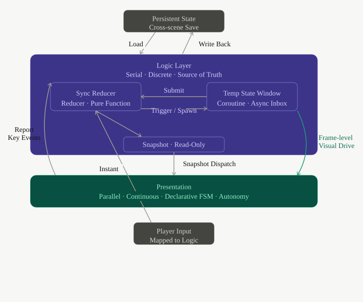

<p align="center">
  
</p>

<p align="center">
  <a href="README_CN.md">中文</a>
</p>

<h2 align="center">An Event-Driven Game State Engine<br>for the AI Era</h2>


## Design Philosophy

In the broad discussion of game architecture, `Game Loop` and `Event-driven` can be seen as the two most fundamental top-level driving philosophies.

Modern game engines typically adopt `Game Loop` as the top-level design. Input collection, logic advancement, animation updates, physics simulation, and rendering submission are mostly organized along the same frame timeline. Event mechanisms certainly exist, but they serve more as an internal communication method within the loop, rather than the supreme driver of world state.

**Cobweb takes a different approach by placing event-driven design above the `Game Loop`.**

It views a game first and foremost as a **deterministic state machine**: player inputs, rule triggers, phase transitions, and numerical changes are all essentially definable and verifiable state transitions. Logic and presentation must be loosely coupled; the Game Loop still exists, but primarily serves the presentation world, while the entire game is driven forward in units of events that produce state changes.

**It advocates abandoning the decades-old "What You See Is What You Get" engineering paradigm in game development, and establishing a system that is fully perceivable, computable, and automatable by generative AI:** define computable event rules first, then assemble rendering components. The essence of a game is a deterministic state machine; the Logic Layer becomes the sole authority, and the Presentation Layer retreats into a replaceable projection.

Under this architecture, the Logic Layer defines all macro discrete events (attack, acquire equipment, complete quest), and dispatches state changes to the Presentation Layer. The Presentation Layer is responsible for orchestrating these discrete changes into continuous audio-visual experiences — character models, health bars, and effect systems are all composable, nestable, decomposable, and independently testable rendering components, just like modern frontend UI libraries.

### Architectural Code Comparison

**Traditional Game Loop: Frame-based**

```cpp
while (running) {
    processInput();
    update();          // Logic, animation, and physics often mixed here
    render();
}
```

**Cobweb: Event-based**

```js
engine.use({
  events: { 'action:perform': {} },
  rules: [
    {
      id: 'core:action',
      hooks: {
        'event:action:perform': `...`,
      },
    },
  ],
})

State.emit('action:perform', { ... })      // Event-driven rendering
```

> Because the sole entry point for rules is events, every rule derivation has complete boundaries: from the root event trigger to the end of the state chain, all intermediate state changes are produced internally. This means **the entire game process is recordable, traceable, and globally perceivable by generative AI** — all natural products of this architecture.

---

## Reading List

> Understanding Cobweb is not about the code, but about the **event-driven architecture** paradigm it establishes.

| Document | Why Read |
|----------|----------|
| **[Dual-World Design](docs/Dual-World-Theory.md)** | **Core architectural philosophy**. A complete derivation from "Logic vs Presentation" through state layering, rendering component autonomy, temporary states, and deterministic structure. |
| **[How to Understand Dual-World Design](docs/How-to-Understand-Dual-World-Theory.md)** | **Developer paradigm shift**. Uses Rust's borrow checker, CQRS, and frontend state management as classical paradigms to answer how to map the theory to actual code. |
| **[FAQ](docs/FAQ.md)** | **Common questions answered**. Detailed explanations of event-driven vs frame-driven, ECS comparison, performance concerns, and other core confusions. |
| **[Causal World and Case Studies](docs/Causal-World-and-Case-Studies.md)** | **Developer operations manual**. The three questions every mechanism must answer before implementation, complete decision trees with demonstrations, and analysis of common misattributions. |

---

## Presentation Layer

After separating the logic world from the presentation world, the latter faces a real engineering pressure: it cannot simply "draw snapshots." Animations require time, transitions require interpolation, and interactions require immediate feedback. To solve this, Cobweb introduces the idea of frontend component autonomy.

> **Presentation is not logic; the rendering layer holds presentation but not logic.**  
> This is the cornerstone of Cobweb.

Rendering components are the smallest units of the presentation layer. Their essence is a **declarative state machine**: declaring what states it has, which transitions are valid, and which transitions need to be reported to the logic layer. `update(dt)` drives internal continuous animation for the state, but is not the core of the component. Rendering components are composable, nestable, and independently testable, and cannot privately modify the Logic Layer state.

---

## Dual-World Design

> **[→ Read the full theoretical derivation](docs/Dual-World-Theory.md)**
>
> The following is a core overview of Dual-World Design. For the complete derivation (Logic vs Presentation, State Layering, Rendering Component Autonomy, Temporary States, Deterministic Structure, Boundary Judgment), please read the full theory document linked above.

Dual-World Design divides the system into two layers: the **Logic Layer** maintains game state, and the **Presentation Layer** maintains continuous perception.

The logic layer holds two things: the current world snapshot, and rule functions that process events. Each time an event arrives, rules run, state updates, and the change process is completely recorded. The presentation layer reads these results and presents discrete state changes as continuous audio-visual experiences.

The boundary of responsibilities between the two layers can be judged by a single criterion: **does this change the game state?** What modifies data belongs to the Logic Layer; what merely produces view side-effects belongs to the Presentation Layer. Character running, heavy rain, and flowing hair stay in the presentation layer; HP changes, equipment acquisition, and scene switching are reported to the logic layer as events.

### State Layering

Based on the lifecycle of state, the system's data naturally divides into three layers:

| Layer | Responsibility & Features |
|-------|---------------------------|
| **Persistent State** | Cross-scene save data. Maintains long-term data (character level, inventory, quest progress), does not participate in combat calculations. |
| **Logic Layer / Scene** | The state deduction center for the current scene. All battle rules, event processing, and state changes happen here in absolute serial order. At the end of the scene, key data is written back to persistent state, and the rest is destroyed. |
| **Presentation Layer / Rendering Component Tree** | A pure rendering component tree. Maps discrete state changes into parallel, continuous, multi-track sensory experiences. Holds no game state, can be rebuilt at any time. |

### Architecture Diagram



**Three-Layer Relationship:**

- **Persistent State** — Save layer, shared across scenes. Loaded at startup, saved at key moments, synchronized on exit.
- **Logic Layer** — Can be understood as a Scene, the state deduction center for the current scene, corresponding to a rendering component tree.
- **Presentation Layer** — Visualization of the logic layer, composed of a declarative rendering component tree. Each rendering component autonomously manages state, animation, and interaction, and can gracefully self-interrupt when behavior is interrupted.

---

## A Slay the Spire Verification Demo

In Cobweb's implementation of Slay the Spire, logic and rendering are strongly separated. AI can easily create and modify game rules at the Logic Layer. Even for very complex event descriptions — such as a chain of multiple triggers, damage amplification, damage reduction, revenge, and deathrattle — AI handles them accurately. The Logic Layer knows nothing of the Presentation Layer's existence, meaning multiple different visual representations can coexist.

```bash
git clone https://github.com/shixiangxi0/Cobweb.git
pnpm install
```

**CLI Mode** (Terminal)

```bash
pnpm sts
```

**Phaser Mode** (Game Interface)

```bash
pnpm phaser
# Open http://localhost:5173
```
