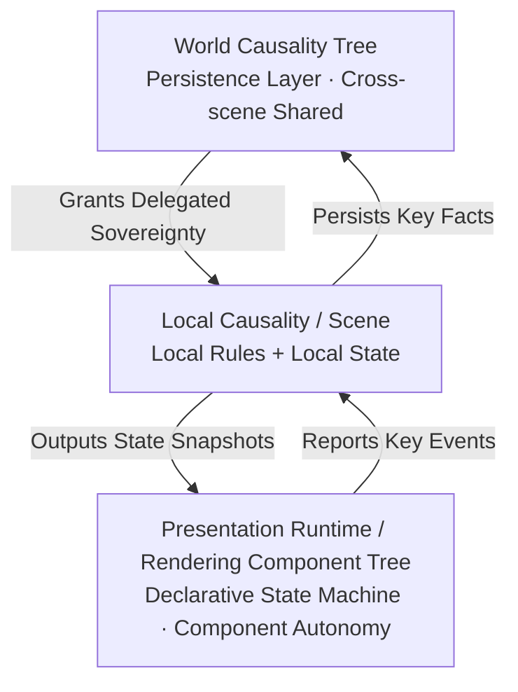

<p align="center">
  
</p>

<p align="center">
  <a href="README_CN.md">中文</a>
</p>

<h2 align="center">An Event-Driven Game Engine Paradigm<br>for the AI Era</h2>


## Design Philosophy

In the broad discussion of game architecture, `Game Loop` and `Event-driven` can be seen as the two most fundamental top-level driving philosophies.

Modern game engines typically adopt `Game Loop` as the top-level design. Input collection, logic advancement, animation updates, physics simulation, and rendering submission are mostly organized along the same frame timeline. Event mechanisms certainly exist, but they serve more as an internal communication method within the loop, rather than the supreme arbiter of world causality.

**Cobweb takes a different approach by placing event-driven design above the `Game Loop`.**

It views a game first and foremost as a **deterministic causal system**: player inputs, rule triggers, phase transitions, and numerical changes are all essentially definable and verifiable state transitions. Logic and presentation must be loosely coupled; the Game Loop still exists, but primarily serves the presentation world, while the entire game is driven forward in units of events that produce causality.

### Architectural Code Comparison

**Traditional Game Loop: Frame-based**

```cpp
while (running) {
    processInput();
    update();          // Logic, animation, and physics often mixed here
    render();
}
```

**Cobweb: Event-based**

```js
engine.use({
  events: { 'action:perform': {} },
  rules: [
    {
      id: 'core:action',
      hooks: {
        'event:action:perform': `...`,
      },
    },
  ],
})

State.emit('action:perform', { ... })      // Event causality drives rendering
```

> Because the sole entry point for rules is events, every rule derivation has complete boundaries: from the root event trigger to the end of the causal chain, all intermediate state changes are produced internally. This means **the entire game process is recordable, traceable, and globally perceivable by generative AI** — all natural products of this architecture.

---

## Reading List

> Understanding Cobweb is not about the code, but about the **causal engineering** paradigm it establishes.

| Document | Why Read |
|----------|----------|
| **[Dual-World Theory](docs/Dual-World-Theory.md)** | **Core architectural philosophy**. A complete derivation from "Two Kinds of Causality" through Three Layers of Sovereignty, Rendering Component Autonomy, Temporal Causal Sovereignty, and Deterministic Structure. |
| **[How to Understand Dual-World Theory](docs/How-to-Understand-Dual-World-Theory.md)** | **Developer paradigm shift**. Uses Rust's borrow checker, CQRS, and frontend state management as classical paradigms to answer how to map the theory to actual code. |
| **[Demo: Interruptible Attack](docs/Demo-Interruptible-Attack.md)** | **Minimal code example**. 60 lines demonstrating Temporal Causal Sovereignty, interruptibility, and logic/presentation separation. |

---

## Presentation Layer

After separating the logic world from the presentation world, the latter faces a real engineering pressure: it cannot simply "draw snapshots." Animations require time, transitions require interpolation, and interactions require immediate feedback. To solve this, Cobweb introduces the idea of frontend component autonomy.

> **Presentation is not logic; the rendering layer holds presentation but not logic.**  
> This is the cornerstone of Dual-World Theory.

Rendering components are the smallest units of the presentation layer. Their essence is a **declarative state machine**: declaring what states it has, which transitions are valid, and which transitions need to be reported to the logic layer. `update(dt)` drives internal continuous animation for the state, but is not the core of the component. Rendering components are composable, nestable, and independently testable, and cannot privately modify the Local Causality state.

---

## Dual-World Theory

> **[→ Read the full theoretical derivation](docs/Dual-World-Theory.md)**
>
> The following is a core overview of Dual-World Theory. For the complete derivation (Two Kinds of Causality, Three Layers of Sovereignty, Rendering Component Autonomy, Temporal Causal Sovereignty, Deterministic Structure, Golden Standard), please read the full theory document linked above.

Dual-World Theory divides the system into two worlds: the **Logic World** maintains causal facts, and the **Presentation World** maintains continuous perception.

The logic layer holds two things: the current world snapshot, and rule functions that process events. Each time an event arrives, rules run, state updates, and the change process is completely recorded. The presentation layer reads these results and presents discrete state changes as continuous audio-visual experiences.

The boundary of responsibilities between the two worlds can be judged by a single criterion: **does this affect future causal deduction?** What affects it belongs to the Logic World; what doesn't belongs to the Presentation World. Character running, heavy rain, and flowing hair stay in the presentation layer; HP changes, equipment acquisition, and scene switching are reported to the logic layer as events.

### Sovereignty Relationship

Based on the nature of causality, the system's power is naturally divided into a strict three-layer structure:

| Layer | Sovereignty | Responsibility & Features |
|-------|-------------|---------------------------|
| **World Causality Tree** | Ultimate Causal Sovereignty | Maintains permanent facts across scene boundaries, never participates in local rule calculations, and possesses absolute preemption power over lower layers. |
| **Local Causality** | Delegated Sovereignty | A temporary delegate for the current scene. Responsible for all battle state and event deductions. Event flow is absolutely serial. |
| **Presentation Runtime** | Perceptual Sovereignty | A pure rendering component tree. Maps discrete causality into parallel, continuous, multi-track sensory experiences. As it holds no causal facts, interrupting or discarding it carries zero risk. |

### Architecture Diagram



**Three-Layer Relationship:**

- **World Causality Tree** — Persistence layer, shared across scenes. Read at startup, written back at key events, synchronized on exit.
- **Local Causality** — Can be understood as a Scene, a temporary delegate of causal sovereignty, corresponding to a rendering component tree.
- **Presentation World** — Visualization of local causality, composed of a declarative rendering component tree. Each rendering component autonomously manages state, animation, and interaction.

---

## Quick Start

```bash
# Install dependencies
pnpm install
```

**CLI Mode** (Terminal)

```bash
pnpm sts
```

**Phaser Mode** (Game Interface)

```bash
pnpm phaser
# Open http://localhost:5173
```
