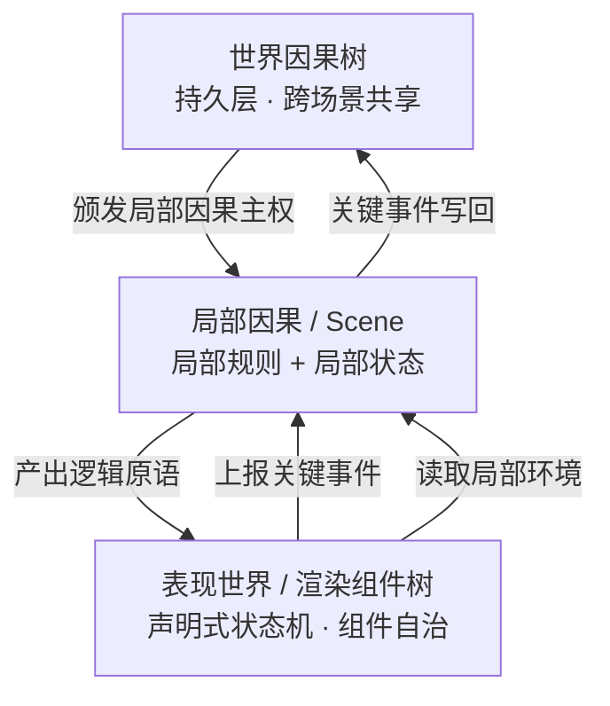

# Cobweb：AI时代，一种离经叛道的游戏引擎范式


## 设计思想

在游戏架构的广义讨论里，`Game Loop` 和 `Event-driven` 可以被视为两种最基础的顶层驱动哲学。

现代游戏引擎通常以 `Game Loop` 为顶层设计。输入采集、逻辑推进、动画更新、物理模拟和渲染提交，大多被放在同一条帧时间线上组织。事件机制当然也存在，但更多是循环内部的通信方式，而不是世界因果的最高裁决者。

Cobweb 的出发点不一样，它选择将事件驱动置于`Game Loop`之上。

它把游戏首先看成一个**确定性的因果系统**：玩家输入、规则触发、阶段流转、数值变化，本质上都是可定义、可验证的状态迁移。逻辑与表现必须处于弱耦合，Game Loop 仍然存在，但主要服务于表现世界，整个游戏以事件为单位推动因果产生。

### 架构代码对比
**传统 Game Loop：以帧为单位**

```cpp
while (running) {
    processInput();
    update();          // 逻辑、动画、物理经常混在这里
    render();
}
```

**Cobweb：以事件为单位**

```js
engine.use({
  events: { 'action:perform': {} },
  rules: [
    {
      id: 'core:action',
      hooks: {
        'event:action:perform': `...`,
      },
    },
  ],
})

State.emit('action:perform', { ... })      // 事件因果驱动渲染
```

因为规则的唯一入口是事件，每一次规则推演都有完整的边界：从根事件触发，到因果链结束，中间所有状态变化都在内部产生。这意味着**整个游戏过程是可记录、可追溯，可被生成式AI全局感知**，这些都是这套架构的自然产物。

## 表现层

逻辑世界和表现世界分开之后，表现世界面临一个真实的工程压力：它不能只是"把快照画出来"。动画需要时间，过渡需要插值，交互需要即时反馈。为了解决这个问题，Cobweb 引入了前端组件自治的思想。

**表现不等于逻辑，渲染层持有表现，但不持有逻辑。** 这是双世界理论的基石。

渲染组件是表现层的最小单元，它的本质是一个**声明式状态机**：声明自己有哪些状态、哪些转换是合法的、哪些转换需要上报逻辑层。`update(dt)` 是状态内部连续动画的驱动器，不是组件的核心。渲染组件可组合、可嵌套、可独立测试，不能私自修改世界状态树。

## 双世界理论

双世界理论把系统分成两个世界：**逻辑世界**维护因果事实，**表现世界**维护连续感知。

逻辑层持有两类东西：当前世界快照，和处理事件的规则函数。每次事件进来，规则运行，状态更新，变化过程被完整记录。表现层读取这些结果，将离散的状态变化呈现为连续的视听体验。

两个世界的职责边界只需要一条标准来判断：**这件事是否影响未来的因果推演？** 影响的归逻辑世界，不影响的归表现世界。角色跑动、大雨、长发飘扬，留在表现层；血量变化、获取装备、场景切换，作为事件上报逻辑层。

双世界的主权关系如下：
- **逻辑世界**拥有因果主权——所有影响未来推演的状态，只能由事件驱动修改
- **表现世界**拥有感知主权——如何呈现、动画时序、过渡效果，由渲染组件自治决定

### 架构图



**三层关系：**
- **世界因果树**：持久层，跨场景共享。启动时读入，关键事件时写回，退出时同步。
- **局部因果**：可以理解为 scene，包含局部虚拟状态和局部规则，对应一颗渲染组件树
- **表现世界**：局部因果的可视化，由声明式渲染组件树构成。每个渲染组件自治管理状态、动画与交互，在不影响未来因果推演的情况下可直接读写局部临时状态。

Cobweb 通过渐进式扩展适配不同游戏架构——对大多数游戏，双世界模型已经足够；对高速 ACT 等需要更深控制的场景，可以在此基础上按需引入更复杂的机制，而不是从一开始就承担所有复杂度。


## 快速开始

```bash
# 安装依赖
pnpm install
```

**CLI 模式**（终端模式）

```bash
pnpm sts
```

**Phaser 模式**（浏览器图形界面）

```bash
pnpm phaser
# 打开 http://localhost:5173
```

