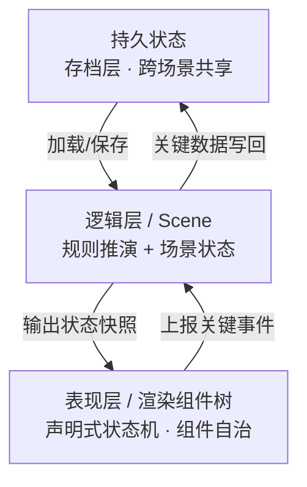

<p align="center">
  
</p>

<p align="center">
  <a href="README.md">English</a>
</p>

<h2 align="center">AI时代，一种基于事件驱动的游戏引擎范式</h2>


## 设计思想

在游戏架构的广义讨论里，`Game Loop` 和 `Event-driven` 可以被视为两种最基础的顶层驱动哲学。

现代游戏引擎通常以 `Game Loop` 为顶层设计。输入采集、逻辑推进、动画更新、物理模拟和渲染提交，大多被放在同一条帧时间线上组织。事件机制当然也存在，但更多是循环内部的通信方式，而不是驱动世界状态的最高机制。

**Cobweb 的出发点不一样，它选择将事件驱动置于 `Game Loop` 之上。**

它把游戏首先看成一个**确定性状态机**：玩家输入、规则触发、阶段流转、数值变化，本质上都是可定义、可验证的状态迁移。逻辑与表现必须处于弱耦合，Game Loop 仍然存在，但主要服务于表现层，整个游戏以事件为单位推动状态变化。

### 架构代码对比

**传统 Game Loop：以帧为单位**

```cpp
while (running) {
    processInput();
    update();          // 逻辑、动画、物理经常混在这里
    render();
}
```

**Cobweb：以事件为单位**

```js
engine.use({
  events: { 'action:perform': {} },
  rules: [
    {
      id: 'core:action',
      hooks: {
        'event:action:perform': `...`,
      },
    },
  ],
})

State.emit('action:perform', { ... })      // 事件驱动渲染
```

> 因为规则的唯一入口是事件，每一次状态变化都有完整的边界：从根事件触发，到状态链结束，中间所有变化都在内部产生。这意味着**整个游戏过程是可记录、可追溯，可被生成式 AI 全局感知**——这些都是这套架构的自然产物。

---

## 必读清单

> 理解 Cobweb 的关键不在于代码，而在于它所建立的**事件驱动架构**范式。

| 文档 | 内容 |
|------|---------|
| **[双世界设计](docs/双世界理论.md)** | **核心架构设计**。从"逻辑层与表现层分离"到"状态分层"的完整阐述，是理解 Cobweb 的根基。 |
| **[如何理解双世界设计](docs/如何理解双世界理论.md)** | **开发者认知转换**。用 Rust 的借用检查、CQRS 与前端状态管理等经典范式，解答如何将这套架构映射到代码。 |
| **[示例：可被打断的攻击](docs/示例-可被打断的攻击.md)** | **极简代码示例**。展示临时状态、可打断、逻辑/表现分离三大核心机制。 |


---

## 表现层

逻辑层和表现层分开之后，表现层面临一个真实的工程压力：它不能只是"把快照画出来"。动画需要时间，过渡需要插值，交互需要即时反馈。为了解决这个问题，Cobweb 引入了前端组件自治的思想。

> **表现不等于逻辑，渲染层持有表现，但不持有逻辑。**  
> 这是 Cobweb 的基石。

渲染组件是表现层的最小单元，它的本质是一个**声明式状态机**：声明自己有哪些状态、哪些转换是合法的、哪些转换需要上报逻辑层。`update(dt)` 是状态内部连续动画的驱动器，不是组件的核心。渲染组件可组合、可嵌套、可独立测试，不能私自修改逻辑层状态。

---

## 双世界设计


> **[→ 阅读完整设计推导](docs/双世界理论.md)**
>
> 下文为双世界设计的核心概述，完整展开（逻辑层与表现层、状态分层、渲染组件自治、临时状态、确定性结构、边界判断）请阅读上方的完整设计文档。

双世界设计把系统分成两层：**逻辑层**维护游戏状态，**表现层**维护连续视听体验。

逻辑层持有两类东西：当前世界快照，和处理事件的规则函数。每次事件进来，规则运行，状态更新，变化过程被完整记录。表现层读取这些结果，将离散的状态变化呈现为连续的视听体验。

两个层次的职责边界只需要一条软件工程的经典标准来判断：**这件事是否会产生状态修改（State Mutation），从而影响唯一的业务可信数据源（Source of Truth）？** 会修改数据的归逻辑层，单纯产生视觉副作用（View Side-Effects）的归表现层。角色跑动、大雨、长发飘扬，留在表现层；血量变化、获取装备、场景切换，作为事件上报逻辑层。

### 状态分层

基于状态的生命周期，系统自然分成三层：

| 层级 | 职责与特征 |
|------|-----------|
| **持久状态** | 跨场景存档。维护需要长期保留的数据（角色等级、背包、任务进度），不参与具体战斗运算。 |
| **逻辑层 / Scene** | 当前场景的状态推演中心。所有战斗规则、事件处理、状态变化都在这里串行发生。场景结束时，关键数据写回持久状态，其余销毁。 |
| **表现层 / 渲染组件树** | 纯粹的渲染组件树。将离散的状态变化映射为并行的、连续的多轨视听体验。不持有游戏状态，可随时重建。 |

### 架构图



**三层关系：**

- **持久状态** —— 存档层，跨场景共享。启动时加载，关键节点保存，场景退出时同步。
- **逻辑层** —— 可以理解为 Scene，当前场景的状态推演中心，对应一棵渲染组件树。
- **表现层** —— 逻辑层的可视化，由声明式渲染组件树构成。每个渲染组件自治管理状态、动画与交互，当行为被打断时能够优雅地自治中断。


---

## 快速开始

```bash
# 安装依赖
pnpm install
```

**CLI 模式**（终端模式）

```bash
pnpm sts
```

**Phaser 模式**（游戏界面）

```bash
pnpm phaser
# 打开 http://localhost:5173
```
