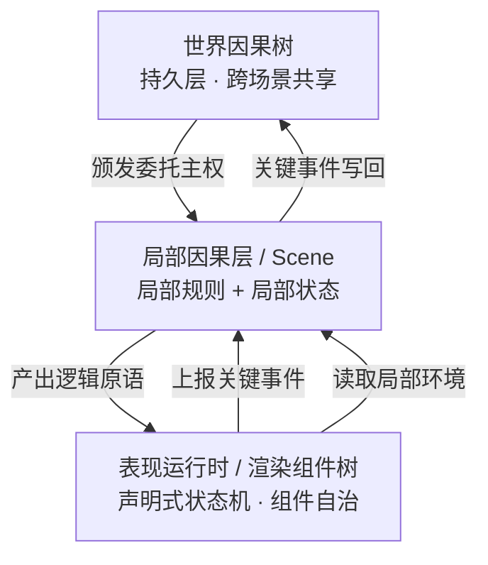

<p align="center">
  
</p>

<p align="center">
  <a href="README.md">English</a>
</p>

<h2 align="center">AI时代，一种基于事件驱动的游戏引擎范式</h2>


## 设计思想

在游戏架构的广义讨论里，`Game Loop` 和 `Event-driven` 可以被视为两种最基础的顶层驱动哲学。

现代游戏引擎通常以 `Game Loop` 为顶层设计。输入采集、逻辑推进、动画更新、物理模拟和渲染提交，大多被放在同一条帧时间线上组织。事件机制当然也存在，但更多是循环内部的通信方式，而不是世界因果的最高裁决者。

**Cobweb 的出发点不一样，它选择将事件驱动置于 `Game Loop` 之上。**

它把游戏首先看成一个**确定性的因果系统**：玩家输入、规则触发、阶段流转、数值变化，本质上都是可定义、可验证的状态迁移。逻辑与表现必须处于弱耦合，Game Loop 仍然存在，但主要服务于表现世界，整个游戏以事件为单位推动因果产生。

### 架构代码对比

**传统 Game Loop：以帧为单位**

```cpp
while (running) {
    processInput();
    update();          // 逻辑、动画、物理经常混在这里
    render();
}
```

**Cobweb：以事件为单位**

```js
engine.use({
  events: { 'action:perform': {} },
  rules: [
    {
      id: 'core:action',
      hooks: {
        'event:action:perform': `...`,
      },
    },
  ],
})

State.emit('action:perform', { ... })      // 事件因果驱动渲染
```

> 因为规则的唯一入口是事件，每一次规则推演都有完整的边界：从根事件触发，到因果链结束，中间所有状态变化都在内部产生。这意味着**整个游戏过程是可记录、可追溯，可被生成式 AI 全局感知**——这些都是这套架构的自然产物。

---

## 必读清单

> 理解 Cobweb 的关键不在于代码，而在于它所建立的**因果工程化**范式。

| 文档 | 内容 |
|------|---------|
| **[双世界理论](docs/双世界理论.md)** | **核心架构设计哲学**。从“两种因果”、“三层主权”到“黄金标准”的阐述，是理解 Cobweb 思想的根基。 |
| **[如何理解双世界理论](docs/如何理解双世界理论.md)** | **开发者认知转换**。用 Rust 的借用检查、CQRS 与前端状态管理等经典范式，解答如何将理论映射到双世界的认知上。 |
| **[示例：可被打断的攻击](docs/示例-可被打断的攻击.md)** | **极简代码示例**。展示时间因果主权、可打断、逻辑/表现分离三大核心机制。 |


---

## 表现层

逻辑世界和表现世界分开之后，表现世界面临一个真实的工程压力：它不能只是"把快照画出来"。动画需要时间，过渡需要插值，交互需要即时反馈。为了解决这个问题，Cobweb 引入了前端组件自治的思想。

> **表现不等于逻辑，渲染层持有表现，但不持有逻辑。**  
> 这是双世界理论的基石。

渲染组件是表现层的最小单元，它的本质是一个**声明式状态机**：声明自己有哪些状态、哪些转换是合法的、哪些转换需要上报逻辑层。`update(dt)` 是状态内部连续动画的驱动器，不是组件的核心。渲染组件可组合、可嵌套、可独立测试，不能私自修改世界状态树。

---

## 双世界理论


> 下文为双世界理论的核心概述，完整展开（两种因果、三层主权、渲染组件自治、时间因果主权、确定性结构、黄金标准）请阅读上文的完整理论文档。

双世界理论把系统分成两个世界：**逻辑世界**维护因果事实，**表现世界**维护连续感知。

逻辑层持有两类东西：当前世界快照，和处理事件的规则函数。每次事件进来，规则运行，状态更新，变化过程被完整记录。表现层读取这些结果，将离散的状态变化呈现为连续的视听体验。

两个世界的职责边界只需要一条标准来判断：**这件事是否影响未来的因果推演？** 影响的归逻辑世界，不影响的归表现世界。角色跑动、大雨、长发飘扬，留在表现层；血量变化、获取装备、场景切换，作为事件上报逻辑层。

### 主权关系

基于因果性质的切割，系统权力自然被划分为严格的三层结构：

| 层级 | 主权 | 职责与特征 |
|------|------|------|
| **世界因果树** | 终极因果主权 | 维护跨越场景边界的永久事实，不参与局部规则运算，具备对下层的绝对抢占权。 |
| **局部因果层** | 委托主权 | 是当前场景的一段“临时租界”或“时间沙盒”。负责进行所有战斗状态、事件推演。事件流转绝对串行。 |
| **表现运行时** | 感知主权 | 纯粹的渲染组件树。负责将离散因果映射为并行的、连续的多轨感官体验。由于不持有任何因果事实，可以无风险打断或废弃。 |

### 架构图



**三层关系：**

- **世界因果树** —— 持久层，跨场景共享。启动时读入，关键事件时写回，退出时同步。
- **局部因果层** —— 可以理解为 Scene，委托主权的暂时代理，对应渲染组件树。
- **表现运行时** —— 由声明式渲染组件树构成。每个渲染组件自治管理状态、动画与交互，当行为被打断时能够优雅地自治中断。


---

## 快速开始

```bash
# 安装依赖
pnpm install
```

**CLI 模式**（终端模式）

```bash
pnpm sts
```

**Phaser 模式**（游戏界面）

```bash
pnpm phaser
# 打开 http://localhost:5173
```
