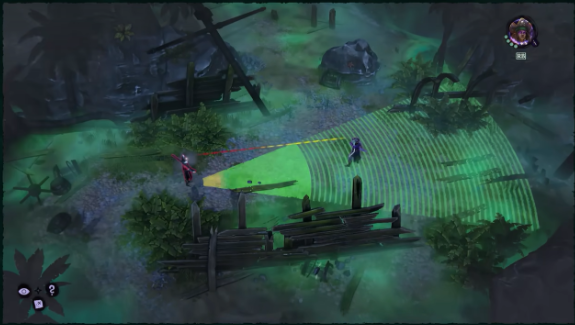
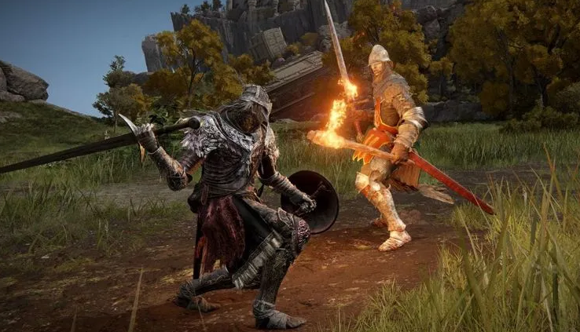

# Causal World and Case Studies

Dual-World Design is built on two fundamental distinctions: the separation of presentation and logic, and the separation of continuous and discrete. The former answers **which states belong to world facts and which belong to sensory projection**; the latter answers **whether state changes happen in an instant or persist over time**.

Above these two distinctions lies an even more fundamental question:

**What kind of change is this thing in the game world?**

This is not an abstract philosophical question, but the starting point of all implementation decisions. Whether you ultimately classify it into the Logic Layer or the Presentation Layer; whether you make it an instant resolution or an interruptible process; whether you allow it to trigger subsequent rules or cut it off at the current step—all of these depend on understanding its position in the causal chain.

In other words, Dual-World Design requires developers to first clarify the causal position of a mechanism before talking about implementation.

Before implementing any mechanism, answer three questions:

1. Is this a projection, or a state change?
2. Is it an instant cause, or a process cause?
3. Will this change continue to propagate, forming a chain reaction?

These three questions may appear sequential, but they are actually **independent judgments**. Visual feedback in the presentation layer also has instant-completion versus persistent-process variants; a local resolution inside a persistent window may also be an isolated event that triggers no follow-up rules. Do not assume that only state changes have instant-versus-persistent distinctions.

---

## Step 1: Is This a Projection, or a State Change?

The first cut is always:

**After this thing ends, have the facts of the game world changed?**

If nothing has changed, it is a **projection** (i.e., visual effect, view side-effect).

The sword-swing animation finishes, and the world has not changed. Whether the attack animation plays faster or slower does not affect subsequent rule deduction. Hit-flash, screen shake, particle effects, health-bar tweening, character turning, camera push-pull—all belong to the same category. They serve sensory experience but do not constitute world facts, and are therefore managed autonomously by rendering components. They can be discarded and rebuilt at any time, because what is lost is only experience, not fact.

If something has changed, it is a **state change**.

Health drops from 100 to 87, and the world is now different. All subsequent rules that depend on health must continue deducing from this new fact. Acquiring equipment, applying statuses, removing enemies, advancing levels, writing quest progress—all belong to this category. They are not display; they are writes to the current world facts.

This step is the most basic boundary in Dual-World Design. The criterion is not "does this look important" or "can the player see it," but rather:

**Will it become the basis for subsequent rules to read and deduce from?**

If the answer is yes, it is no longer just presentation.

---

## Step 2: Is It an Instant Cause, or a Process Cause?

After determining attribution, you must judge whether it completes in an instant or requires persistent duration:

**Is the conclusion established instantaneously, or must it pass through a persistent time window before it can be established?**

This corresponds to **instant resolution** and **process advancement** in Dual-World Theory.

### Instant Cause

If the conclusion is directly established at a single moment, with no intermediate state that needs to be maintained, it is an **instant cause**.

**Logic Layer examples**: The moment damage resolution completes, how much health is deducted is already determined, and the fact is written immediately. Drawing a card, removing a status, death determination, loot pickup, and mana deduction also belong to this category. Their common characteristic is that once the conclusion is produced, this step is already complete; there is no "in-progress" logical state.

**Presentation Layer examples**: Hit-flash (no transition), UI pop-up sudden appearance, single screen shake. These visual feedbacks do not need to maintain intermediate states; execution equals completion.

The point of an instant cause is not "it happens fast," but rather **its conclusion is committed at a discrete moment in time**. There is no question of interruption, because it is already complete the instant it occurs.

### Process Cause

If a mechanism must first open a persistent logical or presentation window, and only submits its conclusion when the window ends, it is a **process cause**.

**Logic Layer examples**: Charging for three seconds before releasing a skill is the typical example. During these three seconds, the system has not yet completed the skill release; rather, it is maintaining an in-progress logical window: it continuously listens to the passage of time, may be interrupted, may be ended early, and only when the window closes normally does it submit the final conclusion to the Logic Layer. Block judgment windows, combo input windows, guided casting, reading-bar door opening, persistent burn statuses, and ongoing super-armor periods also belong to this category. They are not an instantaneous conclusion, but a logical existence with a lifecycle.

**Presentation Layer examples**: Health-bar tweening animation (sliding from 100 to 87 over 0.3 seconds), pursuit movement interpolation trajectory, continuously playing particle effects, ambient audio fade-in and fade-out. If these processes are interrupted midway, the rendering component needs to handle the transition itself, but they do not change world facts.

The three most important characteristics of a process cause are:

- It has a clear beginning and end.
- During its existence, it can be preempted or cancelled by higher-level events.
- After it closes, the process itself naturally disappears, leaving only the result of whether the conclusion was submitted.

### Rendering Component Persistent Processes

Although process causes in the presentation layer do not change world facts, they equally require lifecycle management. Animation state machines, tween interpolation, and particle system lifecycles—all of these are temporary windows running inside rendering components. Their greatest difference from temporary states in the Logic Layer is: **when a rendering component's process window is interrupted, it does not need to submit any conclusion to the Logic Layer; it only needs to clean up after itself.** The Logic Layer's temporary window decides whether to discard the corresponding information or report it upward.

---

## Step 3: How Will This Change Propagate?

The first two steps solve "what is this thing itself"; the third step solves "where will it take the world."

**After a state change is committed, will it continue to trigger new rules, generating new state changes?**

If so, the system has entered **chain propagation**.

An attack hitting is an instant cause; triggering bleed stacks after the hit is another instant cause; bleed taking effect at turn end, dealing damage, is yet another instant cause; this damage causing the target to die, and death triggering drops, rewards, and scene advancement—the chain continues forward.

The key here is not "rules explicitly calling each other," but rather:

**Each rule only handles the local causality it is responsible for, but they pass results to subsequent rules through events.**

The attack rule does not need to know the bleed rule exists; the bleed rule does not need to know the death rule exists. They connect through shared event boundaries, so local rules naturally piece together into a complete world evolution chain.

This is the most valuable aspect of event-driven architecture: complex processes do not need to be hard-coded into a giant script in advance; many mechanisms can be inserted into the existing causal chain as local rules and naturally participate in propagation.

### How Rendering Components Connect to Propagation

**Chain propagation usually happens only inside the Logic Layer.** Rendering component hit detection, range determination, and animation triggering behaviors themselves do not produce state changes, and therefore do not directly trigger chain propagation.

But when a rendering component's behavior **touches the logic boundary**—for example, when the rendering component confirms that an attack has truly hit the target—it will report a discrete event to the Logic Layer. From the moment of reporting, this event enters the Logic Layer and becomes a new node in the propagation chain.

This means rendering components are not spectators of propagation, but **one of the propagation starting points**. However, they can only connect to the Logic Layer through this single boundary operation of "reporting an event"; they cannot privately modify logical state, nor can they skip the Logic Layer to directly trigger subsequent rules.

### The Value of Chain Propagation

Chain propagation gives game mechanisms true combinatorial power.

Revenge, deathrattle, counterattack, hit-stacking, death summons, kill-heal, and relic damage amplification—these effects do not need to be pieced together into a fixed process in advance. They can exist independently,接入 at appropriate event points, and ultimately be connected by the propagation chain.

The more complex the mechanism, the more important this combinatorial ability becomes. Because developers no longer need to maintain a constantly expanding central process, but rather maintain an extensible rule graph.

### The Risks of Chain Propagation

Chain propagation is also the most dangerous part. Unbounded propagation leads to three typical problems:

- **Circular dependency**: Event A triggers Event B, and Event B re-triggers Event A; the chain cannot end.
- **Cascading explosion**: One event triggers multiple rules, and each rule produces multiple new events; propagation scale rapidly spirals out of control.
- **State corruption**: A long chain pushes the world into a state that is not sufficiently constrained by any rule, and errors continue propagating forward from this state.

This means that when designing causal propagation, you cannot only ask "can it trigger," but must also ask:

- Which rules only consume events and no longer produce new events?
- Which propagation chains need depth limits, deduplication, or transaction boundaries?
- Which results are design-permitted world collapses, and which are simply system overreach?

What looks like the same "chain reaction" may be either a carefully designed gameplay climax or simply an accident after event propagation runs out of control. The difference is not in appearances, but in whether propagation remains within design boundaries.

---

## Causality First

Many game development workflows have a common habit: write code first, understand the mechanism as you go, and refactor when problems appear. The problem with this approach is that causal relationships get buried in call stacks, temporary states, and patchwork fixes. Design flaws only surface after bugs appear.

Causal derivation requires the opposite order:

**First judge the causal position of the mechanism in the world, then decide how to implement it.**

It is not a matter of first deciding which system should implement it, then reverse-engineering its causal logic; rather, first answer whether this thing belongs to projection, instant cause, or process cause, and whether it will continue to propagate—only then does the implementation method naturally become clear.

Because the Logic Layer is completely separated from the Presentation Layer, developers can perform pure logical deduction and testing on a mechanism's causal chain without rendering or art resources. This deduction does not need a screen; it only needs event streams and rule functions to run. You can even let AI automatically explore various mechanism combinations in the Logic Layer and observe whether the causal chain's output matches expectations—this is one reason Dual-World Design is AI-friendly.

If you cannot clearly answer "when charging is interrupted, is the accumulated energy cleared, preserved, or converted into partial damage," then the problem is not at the code layer but at the design layer: you have not yet completed causal derivation for this mechanism.

Getting stuck at the modeling stage costs far less than discovering problems through bug reports at runtime.

---

## Pre-Implementation Checklist

Before actually writing code, at least answer the following questions:

- After this thing ends, have the facts of the game world changed?
- Does it complete in an instant, or does it require persistent duration—an instant commit, or a persistent logical or presentation window?
- If it is a window, can the window be interrupted, cancelled, or replaced?
- After the window closes, which process states should naturally disappear, and which conclusions should be committed? How should the corresponding rendering component clean up after itself?
- Will this state change continue to trigger subsequent rules?
- If so, what are the endpoints, boundaries, and protective measures of the propagation chain?
- When does a rendering component need to report an event to the Logic Layer, thereby entering the propagation chain?

---

## Case Studies

Below are some commonly encountered examples in game development:

### 1. When a player enters an enemy's vision range, should this event be reported to the Logic Layer?

Suppose that when entering an enemy's vision range, a chain of events is triggered: the enemy detects the player, the enemy pursues the player, and when the player is within the enemy's attack range, the enemy will attack. However, before the enemy's attack actually hits the player, no matter what the enemy does—circling wildly, performing feints, running up to the player and retreating—as long as no actual damage is dealt to the player, it is meaningless to the Logic Layer and can be entirely treated as an active visual ornament.

Only when the enemy triggers an event that deals damage to the player is it reported to the Logic Layer for processing; all other enemy behaviors remain within the rendering component as autonomous presentation.

This approach is suitable for simple game designs. If you want richer game details—for example, when the enemy detects the player, the player enters a fear state, temporarily increasing speed attributes while slightly reducing maximum health; the enemy notifies other enemies within 100 meters to come attack; the enemy enters a pursuit state (displaying health bar, level), and so on—then this entire chain of causality is inappropriate to leave unreported to the Logic Layer. Moreover, reporting to the Logic Layer allows AI to perceive it; **developers themselves can also let AI handle this event autonomously, rather than through traditional game logic algorithms.**

### 2. An enemy attacks a player; the player can dodge or block. But until the specific action occurs, the result cannot be predicted. How does Dual-World Theory decompose this?

First, determine whether the enemy's attack changes future game logical state. It does. Then determine whether this action is instant or process. The answer is process.

A typical real-time action may include attack wind-up, attack animation, hit determination, hit animation, hit-reaction animation, attack recovery, etc. The moment the enemy initiates the attack, the attack wind-up is placed into a temporary window.

**Enemy Attack Process Decomposition**

| Phase | Attribution | Causal Type | Description |
|------|------------|-------------|-------------|
| Attack wind-up | Presentation Layer | Process | Pure animation, can be interrupted at any time, does not change world facts |
| Attack wind-up → Initiate hit determination | **Logic Layer** | **Instant** | At a certain frame, discretely judge: hit / dodged / blocked. This is an **instant cause node** inside the attack process window |
| Dodge animation | Presentation Layer | Process | Player presses dodge within the judgment frame window, successfully triggering dodge; the player component receives the "dodge success" snapshot and performs autonomous presentation |
| Block parry | **Logic Layer** | **Instant** | Player presses block within the judgment frame window, successfully triggering block; this immediately interrupts the enemy's attack animation, the presentation layer transitions to the block animation on its own, and block may be a propagation event (block success, +50% damage for 3 seconds), opening a new event chain |
| Hit-reaction animation | Presentation Layer | Process | Rendering component receives the "hit" event and presents it |
| Damage resolution | **Logic Layer** | **Instant** | Health deduction, triggering Buffs/Debuffs, death determination—all happen here |
| Attack recovery | Presentation Layer | Process | Animation cleanup, does not affect logic |

The most subtle point here is **hit determination**—it occurs inside the attack's "process window," but the determination itself is an **instant cause**. The process window does not submit a conclusion until the hit determination node gives a result, while simultaneously sending an event change to the presentation layer.

As always, what is uncertain is which path will be taken, not whether the path itself exists.
