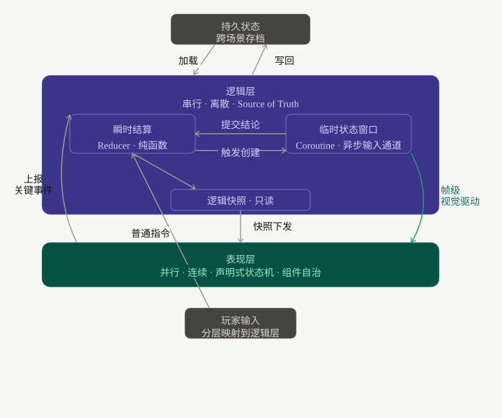

# 双世界设计


---

## 两种状态变化

游戏里存在两种性质根本不同的状态变化。

第一种是**逻辑状态（Source of Truth）**。血量扣减、获得装备、关卡推进——这些事件通过改变游戏状态来决定游戏的走向，是对世界事实的永久写入。它分为两部分：
- **瞬时结算（Sync Reducer）**：局部的纯函数计算，像数据库事务一样瞬间完成数值更新，它是离散的，瞬时的，不可逆的，且**绝对串行的**。
- **过程推进（Async Coroutine/Saga）**：具有生命周期的异步容器，本质上是逻辑层内部的一个**临时状态窗口**（见下文"临时状态"一节）。它挂载在 Update 时间流上，用于消化耗时流程（如蓄力3秒）。在这 3 秒"过程"结束的那一瞬间，它向 Reducer 提交"瞬间结算"指令。

第二种是**视觉效果（View Side-Effects）**。挥刀动画、追击移动、粒子效果——这些纯属为了感官体验产生的派生投影（Projection）。它们的演进不影响任何核心数据流，结束即消失。与逻辑状态的"绝对串行"完全不同，视觉效果是**连续的、并行的**。由于它们不持有也不产出状态事实，自然不存在状态写入竞争。因此，场景中可以有无数个动画、音效、粒子系统真正地"同时"并发挥作用。逻辑引擎里同一帧被强制排队的离散事件，在表现层可以优雅地铺展为多轨并行的视觉呈现。

这两种状态变化运行在不同的轴上（逻辑是离散/串行的，表现是连续/并行的），性质正交。双世界设计的全部，都从这个区分出发。

---

## 状态分层

基于这个区分，系统的状态自然分成三层：

```
持久状态  →  跨场景存档（永久，跨场景）
逻辑层    →  场景状态（随场景生灭）
表现层    →  渲染组件树（可丢弃，不持有状态）
```

**持久状态**是存档层。它只记录需要跨越场景边界的状态事实，不参与局部规则运算。

**逻辑层**是当前场景的状态推演中心。场景内的所有状态变化都在这里发生，场景结束时，重要数据写回持久状态，其余销毁。

**表现层**是渲染组件树。它读取逻辑层的输出，把离散的状态变化呈现为连续体验。它不持有持久状态，但它并不是被动的——这是理解双世界的关键。

## 渲染组件自治

渲染组件不是纯视觉单元，它是**前端组件自治思想在游戏中的延伸**。

一个怪物组件挂载，代表这个怪物存在于世界里。它的 `update(dt)` 里可以跑完整的行为逻辑：检测玩家距离、决策追击、执行攻击前摇。组件卸载，怪物消失。**生命周期本身就是行为的载体。**

组件内的一切——状态、动画、时间相关的行为——默认自治。追击过程中的移动轨迹、攻击动作的帧编排、进入范围的触发检测，这些都在组件内部运行，不需要请示任何上层。

只有当行为**触碰了逻辑层**，才向上报事件：

```
组件内自治（不上报）        触碰逻辑层（上报事件）
──────────────────────     ──────────────────────
追击移动                    命中判定
攻击动画编排                血量扣减
范围检测                    死亡
前摇后摇                    拾取触发
```

这套自治边界让渲染组件成为真正独立的单元——可以组合、嵌套、单独测试，整个组件树的复杂度可以自由拆分，而不影响逻辑层的干净程度。

---

## 临时状态

连续型游戏引出一个更深的问题：ACT 的连击窗口、格挡判定帧、实时物理模拟——这些在一段持续时间内连续地产生状态，它们不是单次事件触发的结果，但它们是真实的状态事实，影响未来推演。它们归属于哪里？

这需要一种**临时状态**机制来解决。

**临时状态是逻辑层的异步输入通道**：它在一个时间窗口内持续运行，窗口结束时向 Reducer 提交结论，是逻辑层消化"耗时过程"的唯一方式。上文提到的"过程推进"，其实现形式就是临时状态窗口。

工程上通常将其视为**结构化并发**。

临时状态归属于逻辑层，而非渲染组件。格挡判定帧、连击窗口都是逻辑层的内部状态，在临时状态的管理下运行——如果把它们放进渲染组件，打断就会引发竞争；因此必须分层管理：打断、撤销等行为，只能是逻辑层的干净状态重置，渲染组件只负责接收新指令，不参与裁决。

临时状态有三个核心属性：

- **有时效**：临时状态存在于一个时间窗口内，窗口关闭，状态自然消亡
- **可撤销**：上层事件到达时，临时状态可以被立即抢占，状态重置
- **沙盒化**：临时窗口只生产结论，不保留过程。过程状态随窗口关闭自然消亡，结论由逻辑层裁决后统一写回。

---

## 确定性结构

临时状态窗口可以被上层随时打断。

比如玩家按下闪避，逻辑层先检查当前是否处于可打断状态。若被硬直帧锁定（不可打断），闪避不执行；若可打断，旧临时窗口的 scope 销毁——中间过程状态随之消亡，结论视情况提交或抛弃——新窗口建立，同时向渲染组件下发新的逻辑快照。被丢弃的动画帧本来就不是状态事实，什么都不会损坏。

**逻辑层的打断是 scope 的取消，与表现层无关。**

表现层收到新的逻辑快照后，渲染组件负责优雅地处理自身的状态切换。在声明式状态机里，这条切换边显式声明：

```
animating ──interrupt──> idle
```

当前动画干净收尾，再切入新状态，不留下视觉残局。这条边存不存在是声明式的、完全确定的——跳转只查它是否存在，表现层不参与任何裁决。

整个系统追求的不是确定性结果，而是确定性结构。闪避有没有成功不确定，但所有可能的结果都被预先枚举，每个出口都有定义好的衔接。不确定的只是走哪条路，不是路本身存不存在。

---

## 边界判断

状态分层落地，始终回到第一性原理的灵魂拷问：

**这件事是否改变游戏状态？**

仅作视觉反馈、不产生写操作的视图副作用（View Side-Effects），归渲染组件，默认自治，随时可丢弃。会触发写操作、但只在当前场景内有效的（临时战斗沙盒、当前局部数据），归逻辑层，随场景生灭。影响跨越场景周期的核心可信数据（Source of Truth），归持久状态，必须落盘存档。